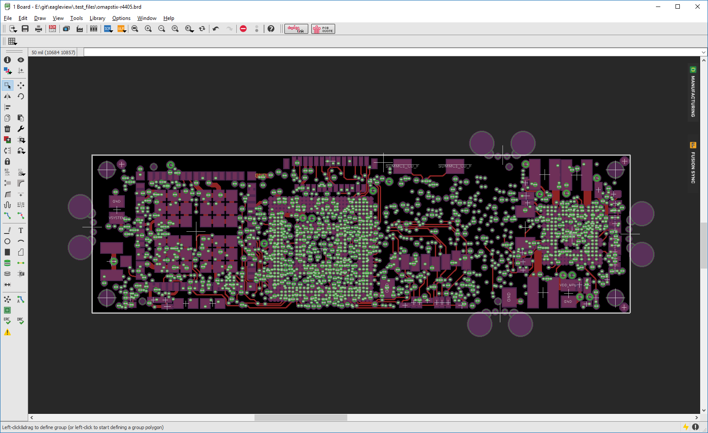
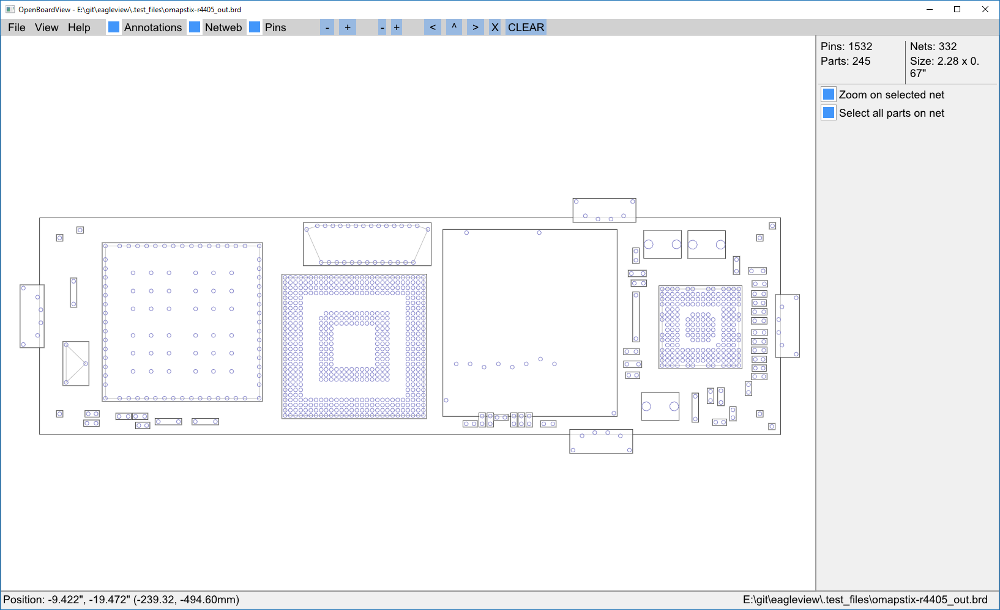
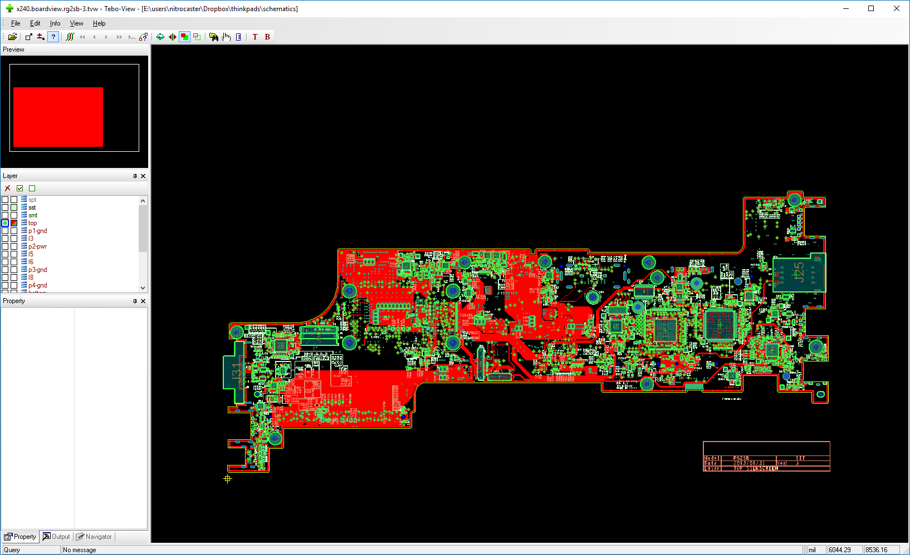
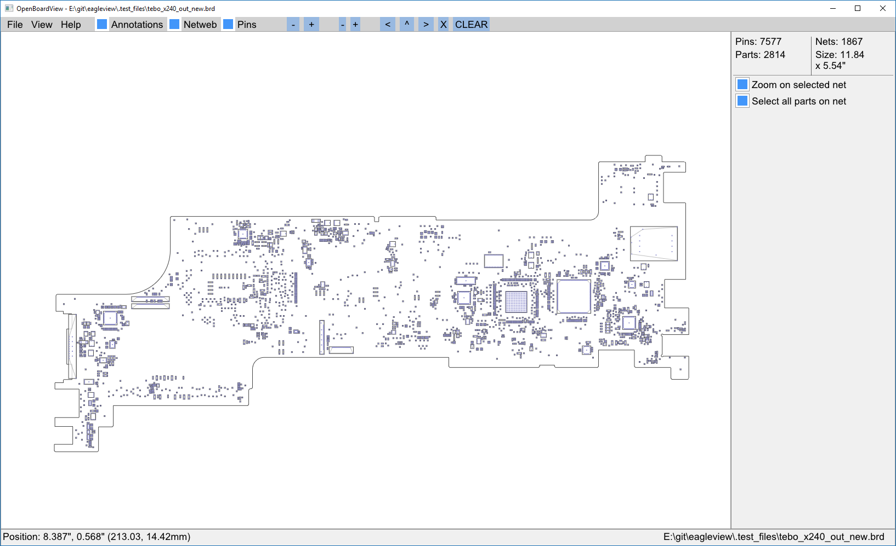

# eagleview

Multi-format boardview conversion utility

This little program was initially made only to convert Autodesk EAGLE boards to Toptest boardview format, which can be opened with [OpenBoardView](https://github.com/OpenBoardView/OpenBoardView) or [FlexBV](https://pldaniels.com/flexbv). This can be helpful if you need to troubleshoot boards which you designed yourself, as Eagle is not the best tool to actually view the board.

Another supported input format is TVW. The only way to view it is to use Tebo-ICT View software. Old versions can be found on the internet; however, it's not a free software and it looks like there's no easy way to buy it, so it was an interesting challenge to take on. TVW file format was reverse engineered to an extent enough for extracting parts, nets, holes, layers, etc.

Examples
---






Prerequisites
---
- C++17 compiler (tested with GCC 9.3 and MSVC 19.25)
- [CMake](https://cmake.org) 3.16+

Installation
---
```
git clone https://github.com/nitrocaster/eagleview.git
cd eagleview
git submodule update --init --recursive
mkdir build && cd build
cmake -DCMAKE_INSTALL_PREFIX="../pkg/" ..
cmake --build . --config Release
cmake --install .
```
Once done, binaries can be found in `pkg/bin`.

TODO
---
- Altium Designer PcbDoc support

Bugs
---
Any bug reports and pull requests are appreciated. Open an issue [here](https://github.com/nitrocaster/eagleview/issues).

Credits
---

Me - nitrocaster
